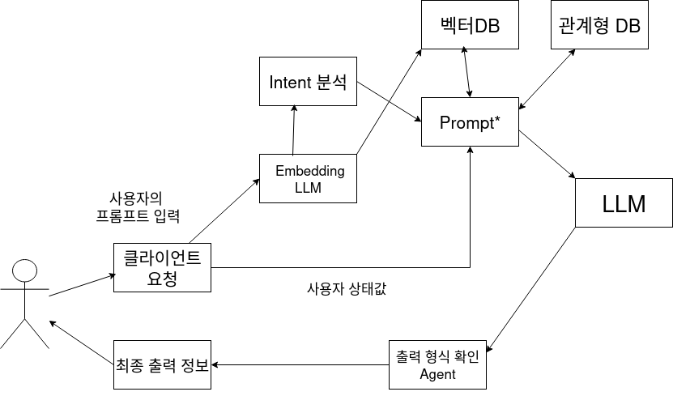
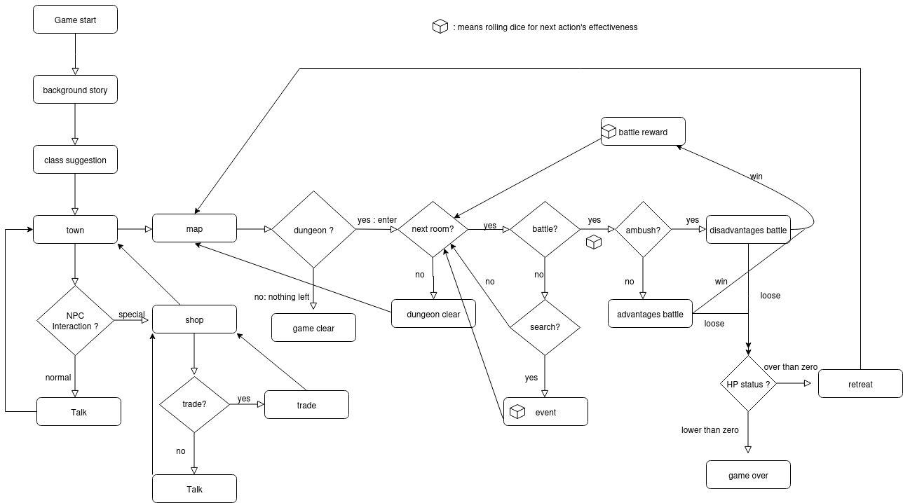

# Project LLM based Dungeon and Dragon TRPG game 

* LLM을 활용해서 서구권에서 인기있는 게임 장르인 TRPG게임의 Game master 역할을 맡게한다.
* 사용자는 LLM이 제안하는 세계, 상황, 이벤트 들을 마주하면서 게임에 몰입하고
* 제안된 목표를 자유롭게 클리어 하면서 게임을 마무리한다. 

## High Level Design




## Clone code

* (각 팀에서 프로젝트를 위해 생성한 repository에 대한 code clone 방법에 대해서 기술)

```shell
git clone https://github.com/xxx/yyy/zzz
```

## Prerequite

* (프로잭트를 실행하기 위해 필요한 dependencies 및 configuration들이 있다면, 설치 및 설정 방법에 대해 기술)

```shell
python -m venv .venv
source .venv/bin/activate
pip install -r requirements.txt
```

## Steps to build

* (프로젝트를 실행을 위해 빌드 절차 기술)

```shell
cd ~/xxxx
source .venv/bin/activate

make
make install
```

## Steps to run

* (프로젝트 실행방법에 대해서 기술, 특별한 사용방법이 있다면 같이 기술)

```shell
cd ~/xxxx
source .venv/bin/activate

cd /path/to/repo/xxx/
python demo.py -i xxx -m yyy -d zzz
```

## Output

* (프로젝트 실행 화면 캡쳐)


## Appendix

* (참고 자료 및 알아두어야할 사항들 기술)
